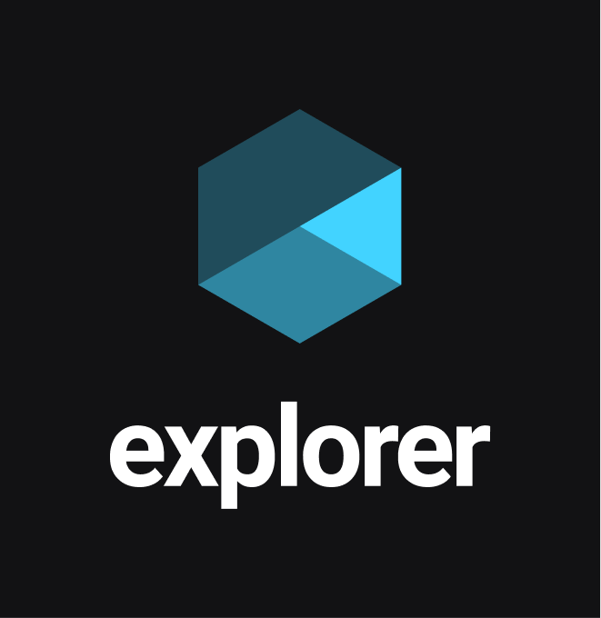

    &nbsp;&nbsp;
    

<h1 align="center"> Trilha Explorer da RocketSeat</h1>
<h2 align="center">Curso iniciado em Outubro de 2023</h2>

🤷‍♂️ Mas o que é a trilha Explorer da RocketSeat?

O Explorer é o programa de formação da Rocketseat, que te leva do zero até a sua primeira vaga em programação.  
Nele você vai aprender desde os fundamentos da programação (a linguagem mais utilizada na programação web - Javascript com React.js e Node.js e também HTML, CSS, git e Bancos de dados SQL) como também as habilidades técnicas e comportamentais específicas que farão de você um profissional pronto para lidar com desafios do mundo real. 

## Road Map: ✍

**Introdução à programação web**:

> Fundamentos da internet; Protocolos; Navegadores; Cliente & servidor; Front-end & Back-end;

**HTML**:

> Configuração de IDE; Ferramentas dev do navegador; Fundamentos do HTML; Tags & atributos; Semântica; Formulários; Mídias;

**CSS**:

> Fundamentos do CSS; Box Model; Flex Layout; Grid Layout; Position; Responsividade; Transformações; Animações e transições; Interpretação de layouts (Figma);

**Lógica de programação**:

> Entendendo problemas; Algoritmos; Paradigmas de programação;

**JavaScript**:

> Fundamentos do JavaScript; Estruturas de dados; Funções; Controles de fluxo; Estruturas de repetição; Expressões e operadores; JavaScript assíncrono; Tratativa de erros; Syntax Sugars; ES Modules; DOM; Web APIs; Manipulação de vetores;

**Encontrando soluções**:

> Forums; Como pesquisar?; Como identificar erros?; Fontes de pesquisa;

**Git & GitHub**:

> Controle de versão; Fundamentos do Git & GitHub;

**Back-end**:

> Fundamentos do back-end; Node.js; NPM (Gerenciador de pacotes); SQL; Criação de API's;

**Front-end**:

> Tipos de aplicações (SSR, SPA); Bibliotecas e frameworks; Transpilers & Bundlers; Pré-processadores CSS; Styled-components; React.js;

**API RESTful**:

> Consumo de API; Integração front-end e back-end; JSON; Autenticação; Testes;

**Deploy de projetos**:

> CI/CD; Digital Ocean; Heroku; Vercel; Netlify;

### Repositórios: 🚀

## Técnologias estudadas 💼🎓

  
  
  
          
  
  
  
   
  
  
  

  ---

  ### <a  href="https://github.com/FelipeMasil/curso-explorer-rocketseat/tree/main/Stage%2001"> Stage 01 ✔ </a>

  ---

  ### <a  href="https://github.com/FelipeMasil/curso-explorer-rocketseat/tree/main/Stage%2002"> Stage 02 ✔ </a>

<a href="https://github.com/FelipeMasil/curso-explorer-rocketseat/tree/main/Stage%2002/Project%2001"> 🛫 Deploy Projeto 01 </a>&nbsp;  
<a href="https://github.com/FelipeMasil/curso-explorer-rocketseat/tree/main/Stage%2002/Project%2002"> 🛫 Deploy Projeto 02 </a>&nbsp;  
<a href="https://github.com/FelipeMasil/curso-explorer-rocketseat/tree/main/Stage%2002/Challenge%2001"> 🚀 Deploy Desafio 01 - Correcting bugs (01) 👀 </a>&nbsp;  
<a href="https://github.com/FelipeMasil/curso-explorer-rocketseat/tree/main/Stage%2002/Challenge%2002"> 🚀 Deploy Desafio 02 - Correcting bugs (02) 👀 </a>&nbsp;  
<a href="https://github.com/FelipeMasil/curso-explorer-rocketseat/tree/main/Stage%2002/Challenge%2003"> 🚀 Deploy Desafio 03 - Semantics and accessibility. 💜 </a>&nbsp;  
<a href="https://github.com/FelipeMasil/curso-explorer-rocketseat/tree/main/Stage%2002/Challenge%2004"> 🚀 Deploy Desafio 04 - Recreating layout</a>&nbsp;  

  

  ---

### Contato

### [**Felipe Manoel Silva**](https://github.com/renyzeraa)

🛠 Developer Jr.  
📍 Votorantim - SP - Brazil

&nbsp;&nbsp;&nbsp;&nbsp;

 